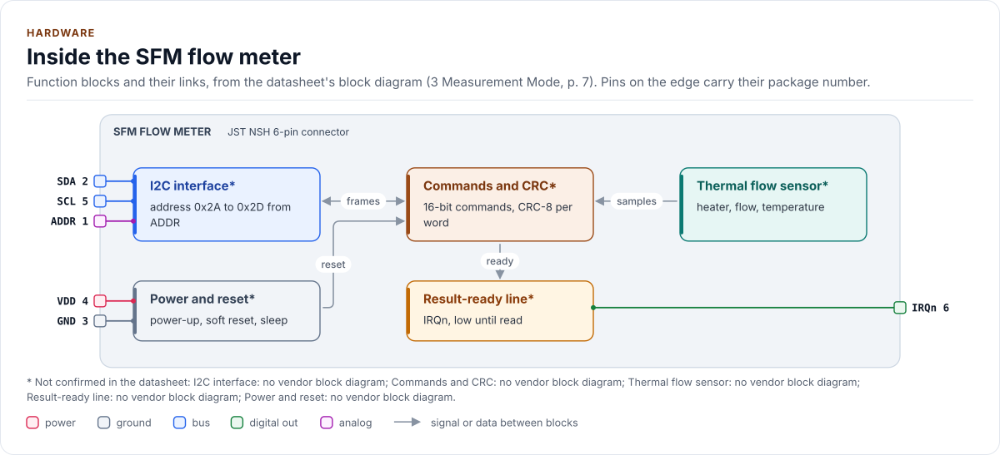
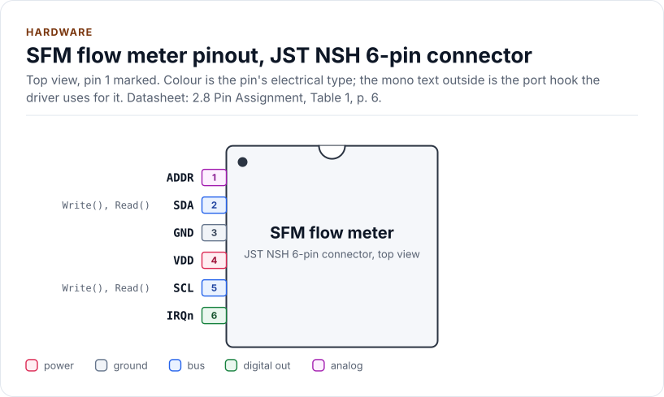

# Figures

<!-- Written by kokeb-docs figures from docs/diagrams/figures/*.py. Do not edit by hand. -->

Every figure on this site is drawn by a Python module from facts extracted from the code, so it is rebuilt,
not redrawn, when the code changes. CI runs `kokeb-docs figures --check` and fails when a
committed figure no longer matches the code. Each figure below lists the files it is drawn from.

## Inside the SFM modules

<!-- figure: chip-blocks -->
<picture>
  <source media="(prefers-color-scheme: dark)" srcset="chip-blocks.dark.svg">
  
</picture>
<!-- /figure -->

Hardware description: [`docs/hardware.yml`](../hardware.yml)

Drawn from:

- [`docs/hardware.yml`](../hardware.yml)
- [`inc/sfm_flow_meter_i2c_interface.hpp`](../../inc/sfm_flow_meter_i2c_interface.hpp)

## SFM modules: Address selection

<!-- figure: chip-circuit-address -->
<picture>
  <source media="(prefers-color-scheme: dark)" srcset="chip-circuit-address.dark.svg">
  
</picture>
<!-- /figure -->

Hardware description: [`docs/hardware.yml`](../hardware.yml)

Drawn from:

- [`docs/hardware.yml`](../hardware.yml)
- [`inc/sfm_flow_meter_i2c_interface.hpp`](../../inc/sfm_flow_meter_i2c_interface.hpp)

## SFM modules: Typical application

<!-- figure: chip-circuit-typical -->
<picture>
  <source media="(prefers-color-scheme: dark)" srcset="chip-circuit-typical.dark.svg">
  
</picture>
<!-- /figure -->

Hardware description: [`docs/hardware.yml`](../hardware.yml)

Drawn from:

- [`docs/hardware.yml`](../hardware.yml)
- [`inc/sfm_flow_meter_i2c_interface.hpp`](../../inc/sfm_flow_meter_i2c_interface.hpp)

## SFM modules package, JST NSH 6-pin 1.0 mm connector

<!-- figure: chip-outline -->
<picture>
  <source media="(prefers-color-scheme: dark)" srcset="chip-outline.dark.svg">
  
</picture>
<!-- /figure -->

Hardware description: [`docs/hardware.yml`](../hardware.yml)

Drawn from:

- [`docs/hardware.yml`](../hardware.yml)
- [`inc/sfm_flow_meter_i2c_interface.hpp`](../../inc/sfm_flow_meter_i2c_interface.hpp)

## SFM modules pinout, JST NSH 6-pin 1.0 mm connector

<!-- figure: chip-pinout -->
<picture>
  <source media="(prefers-color-scheme: dark)" srcset="chip-pinout.dark.svg">
  
</picture>
<!-- /figure -->

Hardware description: [`docs/hardware.yml`](../hardware.yml)

Drawn from:

- [`docs/hardware.yml`](../hardware.yml)
- [`inc/sfm_flow_meter_i2c_interface.hpp`](../../inc/sfm_flow_meter_i2c_interface.hpp)

## The layers, one of them yours

<!-- figure: driver-layers -->
<picture>
  <source media="(prefers-color-scheme: dark)" srcset="driver-layers.dark.svg">
  
</picture>
<!-- /figure -->

Figure module: [`docs/diagrams/figures/driver-layers.py`](../../docs/diagrams/figures/driver-layers.py)

Drawn from:

- `public calls` in [`inc/sfm_flow_meter.hpp`](../../inc/sfm_flow_meter.hpp)
- `I2cInterface` in [`inc/sfm_flow_meter_i2c_interface.hpp`](../../inc/sfm_flow_meter_i2c_interface.hpp)

## Driver states

<!-- figure: driver-states -->
<picture>
  <source media="(prefers-color-scheme: dark)" srcset="driver-states.dark.svg">
  
</picture>
<!-- /figure -->

Hardware description: [`docs/model/driver-states.state.yml`](../model/driver-states.state.yml)

Drawn from:

- [`docs/model/driver-states.state.yml`](../model/driver-states.state.yml)

## Start, wait and read one measurement

<!-- figure: measurement-steps -->
<picture>
  <source media="(prefers-color-scheme: dark)" srcset="measurement-steps.dark.svg">
  
</picture>
<!-- /figure -->

Hardware description: [`docs/model/measurement-steps.seq.yml`](../model/measurement-steps.seq.yml)

Drawn from:

- [`docs/model/measurement-steps.seq.yml`](../model/measurement-steps.seq.yml)
